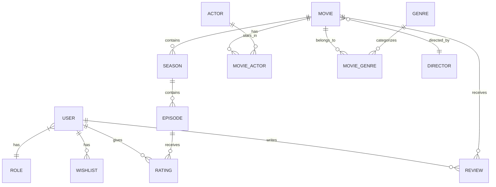
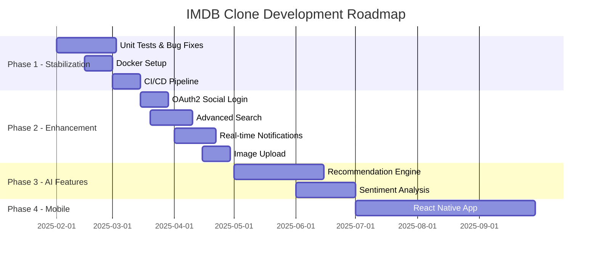

# 📊 Đánh Giá Dự Án IMDB Clone

## 1. Tổng Quan Dự Án

### 1.1 Mục Tiêu
Xây dựng một ứng dụng web clone IMDb - cơ sở dữ liệu phim/TV series với đầy đủ tính năng duyệt phim, đánh giá, review và quản lý danh sách yêu thích.

### 1.2 Công Nghệ Sử Dụng

| Thành phần | Công nghệ | Phiên bản |
|------------|-----------|-----------|
| Backend | Spring Boot | 3.5.6 |
| Frontend | React + TypeScript | React 19, TS 5.9 |
| Build Tool | Vite | 7.2.4 |
| Database | MariaDB | 10.5+ |
| Styling | Tailwind CSS | 3.4.19 |
| Authentication | JWT (JJWT) | 0.13.0 |
| API Docs | SpringDoc OpenAPI | 2.8.14 |

---

## 2. Đánh Giá Điểm Mạnh ✅

### 2.1 Kiến Trúc Tốt

#### Backend (Spring Boot)
- **Kiến trúc phân lớp rõ ràng**: Controllers → Services → Repositories → Models
- **14 JPA Entities** được thiết kế với quan hệ chuẩn (1-N, N-N)
- **13 REST Controllers** với RESTful API chuẩn
- **24 Services** tách biệt business logic
- **JWT Authentication** được implement đầy đủ với Spring Security
- **Swagger UI** tích hợp cho API documentation

#### Frontend (React + TypeScript)
- **Component-based architecture** với tổ chức tốt
- **Custom hooks** (`useFetch`, `useAuth`, `useWishlist`) cho reusable logic
- **TypeScript strict mode** đảm bảo type safety
- **Axios interceptors** xử lý authentication tự động
- **React Context** cho global state management

### 2.2 Tính Năng Đầy Đủ

| Tính năng | Mô tả | Trạng thái |
|-----------|-------|------------|
| 🎬 Quản lý phim/TV series | CRUD movies với seasons/episodes | ✅ Hoàn thành |
| 👤 Xác thực người dùng | Login/Signup với JWT | ✅ Hoàn thành |
| ⭐ Rating & Reviews | Đánh giá và bình luận phim | ✅ Hoàn thành |
| ❤️ Wishlist | Lưu phim yêu thích | ✅ Hoàn thành |
| 🔍 Tìm kiếm | Search movies | ✅ Hoàn thành |
| 🏷️ Thể loại | Phân loại theo genre | ✅ Hoàn thành |
| 🎭 Diễn viên/Đạo diễn | Quản lý cast & crew | ✅ Hoàn thành |
| 📺 TV Series | Seasons & Episodes | ✅ Hoàn thành |
| 👨‍💼 Admin Panel | Quản lý nội dung | ✅ Hoàn thành |

### 2.3 Database Design



### 2.4 Best Practices Được Áp Dụng
- ✅ **DTO Pattern** - Tách biệt API response khỏi entity
- ✅ **Lombok** - Giảm boilerplate code
- ✅ **ModelMapper** - Object mapping tự động
- ✅ **Environment-based config** - application.properties
- ✅ **Code organization** - Feature-based folder structure

---

## 3. Đánh Giá Điểm Yếu & Cải Thiện ⚠️

### 3.1 Backend

| Vấn đề | Mức độ | Đề xuất cải thiện |
|--------|--------|-------------------|
| Thiếu Exception Handling toàn diện | Trung bình | Thêm GlobalExceptionHandler với custom responses |
| Thiếu Pagination chuẩn | Trung bình | Implement Spring Data Pageable cho tất cả list APIs |
| Thiếu Caching | Thấp | Thêm Redis/Caffeine cache cho hot data |
| Thiếu Unit Tests | Cao | Viết JUnit tests cho Services |
| Hardcoded DB credentials | Cao | Sử dụng environment variables |
| Thiếu Validation annotations | Trung bình | Thêm @Valid, @NotBlank cho DTOs |

### 3.2 Frontend

| Vấn đề | Mức độ | Đề xuất cải thiện |
|--------|--------|-------------------|
| Thiếu Error Boundaries | Trung bình | Implement React Error Boundaries |
| Thiếu Loading skeletons | Thấp | Thêm skeleton loading states |
| Thiếu Form validation library | Trung bình | Sử dụng react-hook-form + zod |
| Thiếu State management mạnh | Thấp | Xem xét Zustand/TanStack Query |
| Thiếu i18n | Thấp | Thêm react-i18next cho đa ngôn ngữ |
| Bundle size chưa optimize | Thấp | Code splitting + lazy loading |

### 3.3 DevOps & Deployment

| Vấn đề | Đề xuất |
|--------|---------|
| Thiếu Docker config | Thêm Dockerfile + docker-compose.yml |
| Thiếu CI/CD | Implement GitHub Actions pipeline |
| Thiếu logging framework | Thêm Logback + structured logging |
| Thiếu monitoring | Thêm Spring Actuator + Prometheus |

---

## 4. Hướng Mở Rộng 🚀

### 4.1 Tính Năng Mới - Ngắn Hạn (1-2 tháng)

#### 🔐 Authentication & Security Enhancements
```
├── OAuth2 Social Login (Google, Facebook)
├── Two-Factor Authentication (2FA)
├── Password Reset via Email
├── Rate Limiting cho APIs
└── CSRF Protection
```

#### 📱 User Experience Improvements
```
├── Real-time Notifications (WebSocket)
├── Dark/Light Theme Toggle
├── Responsive Mobile Design Optimization
├── Infinite Scroll cho Movie Lists
└── Image Upload cho Profile & Movies
```

#### 🎯 Content Management
```
├── Advanced Search (filters, sorting)
├── Movie Recommendations based on ratings
├── User Activity History
├── Comment System for Reviews (nested comments)
└── Spoiler Warning Tags
```

### 4.2 Tính Năng Mới - Trung Hạn (3-6 tháng)

#### 🤖 AI & Machine Learning
```
├── Movie Recommendation Engine (Collaborative Filtering)
├── Sentiment Analysis cho Reviews
├── Auto-tagging Movies với NLP
├── Similar Movies Suggestions
└── Personalized Homepage Feed
```

#### 📊 Analytics & Reporting
```
├── Admin Dashboard với Charts
├── User Engagement Metrics
├── Popular Movies Trending
├── Rating Distribution Analytics
└── User Growth Reports
```

#### 🌐 Social Features
```
├── User Following System
├── Movie Lists/Collections (public/private)
├── Share Movies to Social Media
├── User Reviews Feed (timeline)
└── Discussion Forums per Movie
```

### 4.3 Tính Năng Mới - Dài Hạn (6-12 tháng)

#### 🎬 Premium Features
```
├── Streaming Integration (embed players)
├── Watch Party Feature
├── Movie Calendar (upcoming releases)
├── Box Office Data Integration
├── Awards & Nominations Tracking
└── Premium Subscription Tier
```

#### 📱 Mobile App
```
├── React Native Mobile App
├── Offline Mode
├── Push Notifications
├── Biometric Authentication
└── Native Video Player
```

#### 🔄 External Integrations
```
├── TMDb/OMDb API Integration
├── YouTube Trailer Auto-fetch
├── IMDb Data Import
├── Streaming Platform Links (Netflix, Hulu, etc.)
└── Calendar Sync for Release Dates
```

---

## 5. Đề Xuất Kiến Trúc Mở Rộng

### 5.1 Microservices Architecture (Future)

```
┌─────────────────────────────────────────────────────────────┐
│                      API Gateway                            │
│              (Kong / Spring Cloud Gateway)                   │
└──────────────────────┬──────────────────────────────────────┘
                       │
        ┌──────────────┼──────────────┬──────────────┐
        ▼              ▼              ▼              ▼
┌───────────┐  ┌───────────┐  ┌───────────┐  ┌───────────┐
│  Movie    │  │   User    │  │  Review   │  │  Search   │
│  Service  │  │  Service  │  │  Service  │  │  Service  │
└─────┬─────┘  └─────┬─────┘  └─────┬─────┘  └─────┬─────┘
      │              │              │              │
      ▼              ▼              ▼              ▼
┌───────────┐  ┌───────────┐  ┌───────────┐  ┌───────────┐
│  MongoDB  │  │ PostgreSQL│  │ PostgreSQL│  │Elasticsearch│
└───────────┘  └───────────┘  └───────────┘  └───────────┘
```

### 5.2 Technology Stack Upgrades

| Hiện tại | Đề xuất nâng cấp | Lý do |
|----------|------------------|-------|
| MariaDB | PostgreSQL + Redis | Full-text search, caching |
| REST API | GraphQL (optional) | Flexible queries |
| Context API | TanStack Query | Better caching & mutations |
| Manual tests | Jest + Cypress | Automated testing |
| Monolith | Docker + K8s | Scalability |

---

## 6. Roadmap Đề Xuất



---

## 7. Kết Luận

### Đánh giá tổng thể: ⭐⭐⭐⭐ (4/5)

| Tiêu chí | Điểm | Nhận xét |
|----------|------|----------|
| Code Quality | 4/5 | Tổ chức tốt, cần thêm tests |
| Architecture | 4/5 | Chuẩn MVC, sẵn sàng mở rộng |
| Features | 4/5 | Core features đầy đủ |
| Documentation | 4/5 | ONBOARDING.md chi tiết |
| Security | 3/5 | JWT cơ bản, cần hardening |
| Performance | 3/5 | Chưa có caching, pagination |
| DevOps | 2/5 | Thiếu Docker, CI/CD |

### Điểm mạnh nổi bật
1. Kiến trúc fullstack hoàn chỉnh và chuyên nghiệp
2. TypeScript + Spring Boot là stack vững chắc
3. Database design chuẩn hóa tốt
4. Code organization rõ ràng, dễ maintain

### Ưu tiên cải thiện
1. **Bắt buộc**: Thêm unit tests, fix security issues
2. **Quan trọng**: Docker setup, pagination, error handling
3. **Khuyến nghị**: Caching, advanced search, OAuth2

---

> **Ghi chú**: Tài liệu này được tạo dựa trên phân tích code hiện tại. Các đề xuất có thể điều chỉnh dựa trên yêu cầu kinh doanh cụ thể và nguồn lực phát triển.

*Cập nhật lần cuối: Tháng 01/2026*
